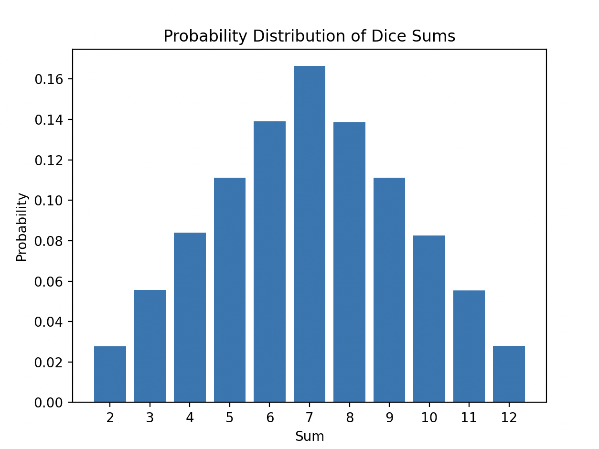
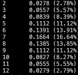

The simulation of throwing two dice one million times has yielded the following probabilities for each sum of the dice, calculated using the Monte Carlo method:

Sum 2: 2.78%
Sum 3: 5.57%
Sum 4: 8.39%
Sum 5: 11.12%
Sum 6: 13.91%
Sum 7: 16.64%
Sum 8: 13.85%
Sum 9: 11.12%
Sum 10: 8.27%
Sum 11: 5.55%
Sum 12: 2.79%

When comparing these results with the analytical calculations provided:

Sum 2: 2.78% (1/36)
Sum 3: 5.56% (2/36)
Sum 4: 8.33% (3/36)
Sum 5: 11.11% (4/36)
Sum 6: 13.89% (5/36)
Sum 7: 16.67% (6/36)
Sum 8: 13.89% (5/36)
Sum 9: 11.11% (4/36)
Sum 10: 8.33% (3/36)
Sum 11: 5.56% (2/36)
Sum 12: 2.78% (1/36)

We can observe that the results obtained from the Monte Carlo method are remarkably close to the analytical probabilities. There are minor differences which are expected due to the random nature of simulations but the overall trend and values closely match the theoretical percentages, showcasing the efficacy of the Monte Carlo method in estimating probabilities through simulation.

This comparison highlights that the Monte Carlo method serves as a powerful and accurate computational approach for solving probabilistic problems and validating theoretical predictions through empirical data generated from simulations.
